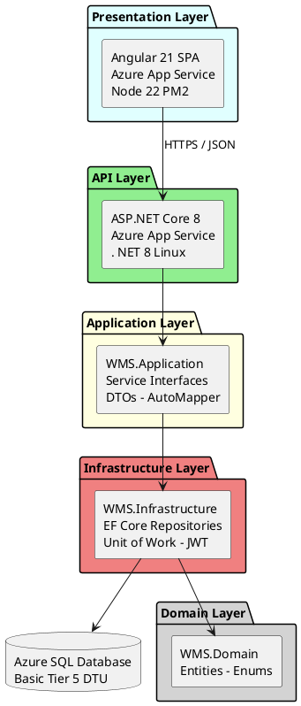
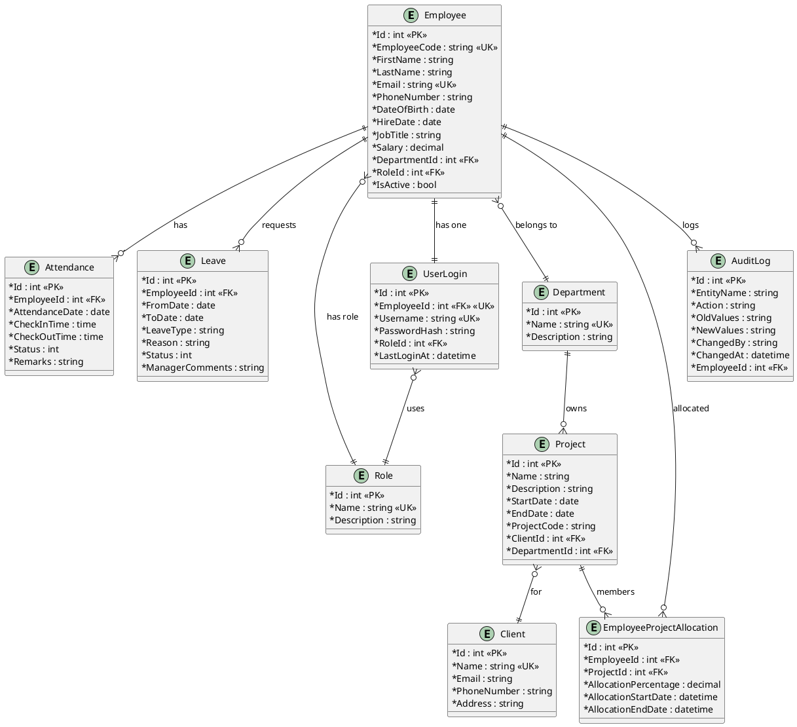
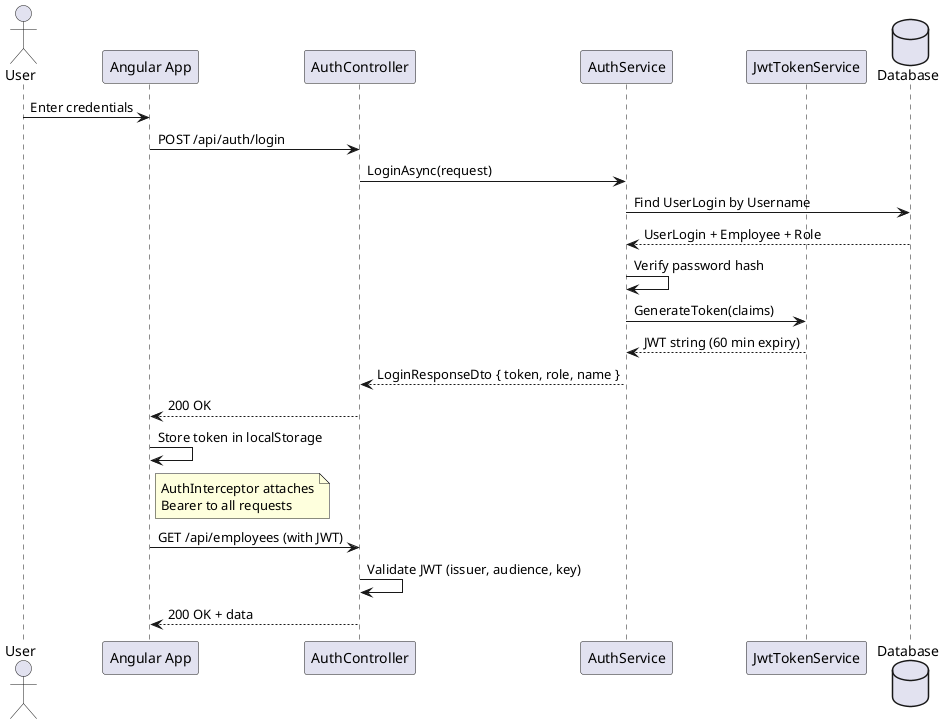
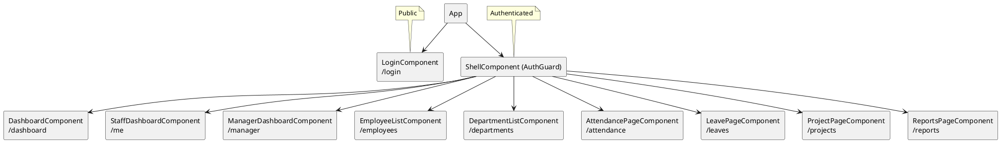
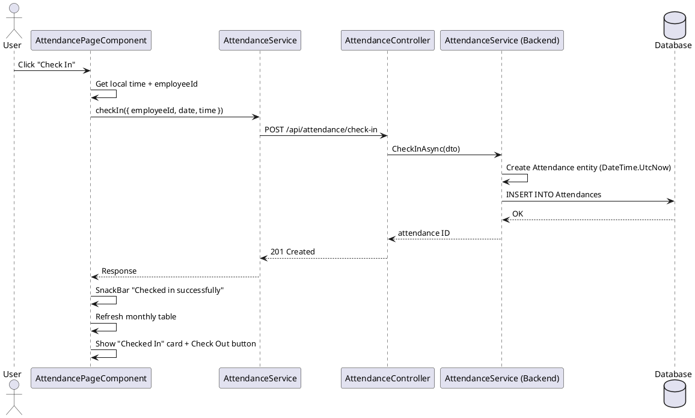
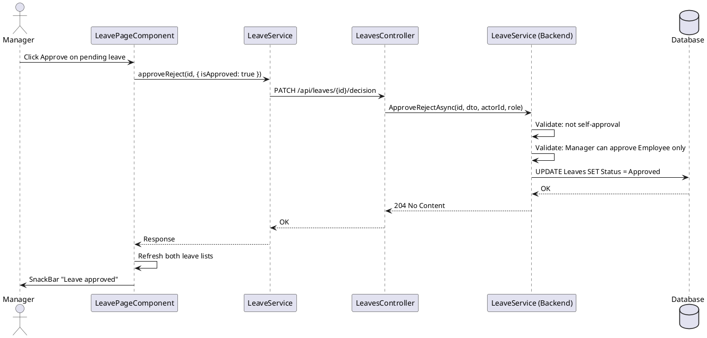

# WMS — High-Level Design Document

## 1. Overview

**Workforce Management System (WMS)** is a full-stack web application for managing employee attendance, leave requests, project allocations, and organizational reporting. Built with ASP.NET Core 8 (Clean Architecture) and Angular 21, deployed to Microsoft Azure via CI/CD.

## 2. System Architecture



## 3. Architectural Principles

| Principle | Application |
|---|---|
| **Clean Architecture** | 4-layer onion: Domain → Application → Infrastructure → API |
| **SOLID** | Single-responsibility services, interface-based DI |
| **Repository + Unit of Work** | Data access abstraction over EF Core |
| **JWT Authentication** | Stateless auth with role-based authorization |
| **Code-First Migrations** | EF Core auto-migrates on application startup |

## 4. Deployment Architecture (Azure)

```plantuml
@startuml
skinparam packageStyle rectangle

rectangle "Azure DevOps Pipeline" as DEVOPS {
  (Build: dotnet + ng build) as BUILD
  (Test: xUnit) as TEST
  (Deploy: AzureWebApp@1) as DEPLOY
  BUILD --> TEST --> DEPLOY
}

rectangle "Resource Group: WMS-RG" as RG {
  node "wms-api-app-123\nApp Service B1 Linux\n.NET 8" as API
  node "wms-client-app\nApp Service B1 Linux\nNode 22" as CLIENT
  database "wms-sql-server\nAzure SQL\nWMSDb Basic" as SQL
}

DEPLOY --> API
DEPLOY --> CLIENT
API --> SQL
CLIENT -right-> API : CORS

@enduml
```

### CI/CD Pipeline

- **Trigger**: `main`, `dev`, `feature/*` branches
- **Build**: `dotnet restore → build → test → publish (zip)` + `npm ci → ng build (prod)`
- **Deploy**: `AzureWebApp@1` (zipDeploy, webAppLinux) for both apps
- **Service Connection**: `AzureServiceConnection` (Contributor on WMS-RG)

## 5. Technology Stack

| Layer | Technology | Version |
|---|---|---|
| Backend Runtime | .NET (ASP.NET Core) | 8.x |
| Frontend Runtime | Angular | 21 |
| UI Framework | Angular Material | 21 |
| ORM | Entity Framework Core | 8.x |
| Database | SQL Server (Azure SQL) | — |
| Auth | JWT Bearer (custom service) | — |
| Mapping | AutoMapper | — |
| CI/CD | Azure DevOps (YAML pipelines) | — |

## 6. Domain Entities & Relationships



## 7. API Endpoints

| Area | Method | Endpoint | Roles |
|---|---|---|---|
| **Auth** | POST | `/api/auth/login` | Anonymous |
| | POST | `/api/auth/change-password` | Any |
| **Employees** | GET | `/api/employees` | Any |
| | GET/POST | `/api/employees/{id}` | Any / Admin+Manager |
| | PUT/DELETE | `/api/employees/{id}` | Admin+Manager / Admin |
| | GET | `/api/employees/search?term=` | Any |
| **Attendance** | GET | `/api/attendance/employee/{id}/month/{y}/{m}` | Any |
| | POST | `/api/attendance/check-in` | Any |
| | POST | `/api/attendance/{id}/check-out` | Any |
| | GET | `/api/attendance/today-active` | Any |
| | GET | `/api/attendance/all` | Admin |
| **Leaves** | GET | `/api/leaves/employee/{id}` | Any |
| | GET | `/api/leaves/pending` | Admin+Manager |
| | POST | `/api/leaves/apply` | Any |
| | PATCH | `/api/leaves/{id}/cancel` | Any |
| | PATCH | `/api/leaves/{id}/decision` | Admin+Manager |
| **Projects** | GET/POST | `/api/projects` | Any / Admin+Manager |
| | PUT/DELETE | `/api/projects/{id}` | Admin+Manager / Admin |
| | GET/POST | `/api/projects/{id}/allocations` | Any / Admin+Manager |
| **Dashboard** | GET | `/api/dashboard` | Any |

## 8. Security Model

### Roles

| Role | Description |
|---|---|
| **Admin** | Full system access — CRUD all entities, change passwords, view reports |
| **Manager** | Manage employees, approve/reject leave (Employee role only), project allocations |
| **Employee** | Self-service — check-in/out, apply/cancel leaves, view own data |

### Authentication Flow



## 9. Frontend Architecture



### Routing

| Path | Component | Guard |
|---|---|---|
| `/login` | LoginComponent | None |
| `/dashboard` | DashboardComponent | AuthGuard |
| `/employees` | EmployeeListComponent | AuthGuard |
| `/attendance` | AttendancePageComponent | AuthGuard |
| `/leaves` | LeavePageComponent | AuthGuard |
| `/projects` | ProjectPageComponent | AuthGuard |
| `/reports` | ReportsPageComponent | AuthGuard |
| `/me` | StaffDashboardComponent | AuthGuard |
| `/manager` | ManagerDashboardComponent | AuthGuard |

### State Management

- **Auth state**: `BehaviorSubject<CurrentUser>` in `AuthService`
- **API data**: Direct HTTP calls via Angular `HttpClient` with `Observable` chain
- **Local storage**: JWT token + user info (`wms_user` key)

## 10. Data Flow Examples

### Check-in Flow



### Leave Approval Flow



## 11. Error Handling

- **ExceptionHandlingMiddleware** catches all unhandled exceptions
- HTTP status mapping:
  - `UnauthorizedAccessException` → 401
  - `InvalidOperationException` → 400
  - `KeyNotFoundException` → 404
  - All others → 500 (logged)
- All responses: `{ statusCode, message }` JSON format
- Frontend displays errors via `MatSnackBar`

## 12. Project Structure

```
WMS-Solution/
├── WMS.Domain/              # Entities, Enums, BaseEntity
├── WMS.Application/         # Services, Interfaces, DTOs, Mapping
├── WMS.Infrastructure/      # EF Core, Repositories, AuthService, JWT
├── WMS.API/                 # Controllers, Middleware, Program.cs
├── WMS.Tests/               # xUnit unit tests
├── WMS-Client/              # Angular 21 frontend (standalone)
└── docs/                    # Design documents
```

## 13. Key Design Decisions

| Decision | Rationale |
|---|---|
| Clean Architecture over simple MVC | Separation of concerns, testability, domain isolation |
| Repository + Unit of Work | Consistent data access, easier to mock in tests |
| AutoMapper over manual mapping | Reduced boilerplate for entity→DTO transformations |
| Standalone Angular components | Simplified module structure, lazy loading readiness |
| ZipDeploy over Git deployment | Clean CI/CD without build servers on App Service |
| Separate App Service Plans per stack | Each service runs optimal runtime (.NET vs Node) |
