# WMS — Low-Level Design Document

## 1. Domain Layer — Entities

### Entity Class Diagram

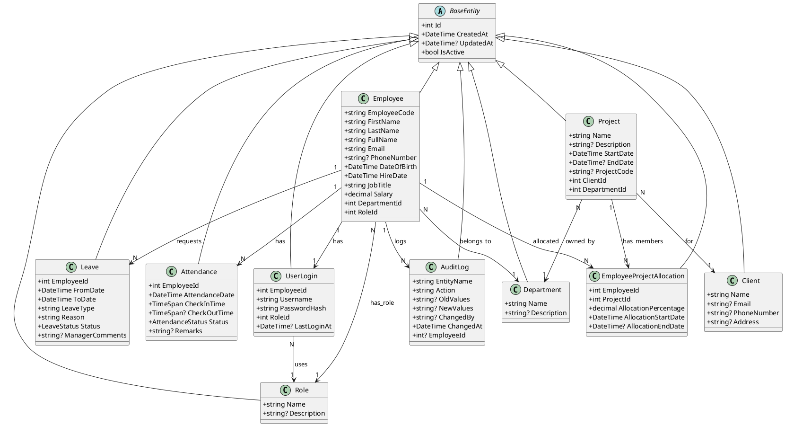

### Enums

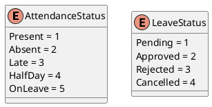

## 2. Database Schema

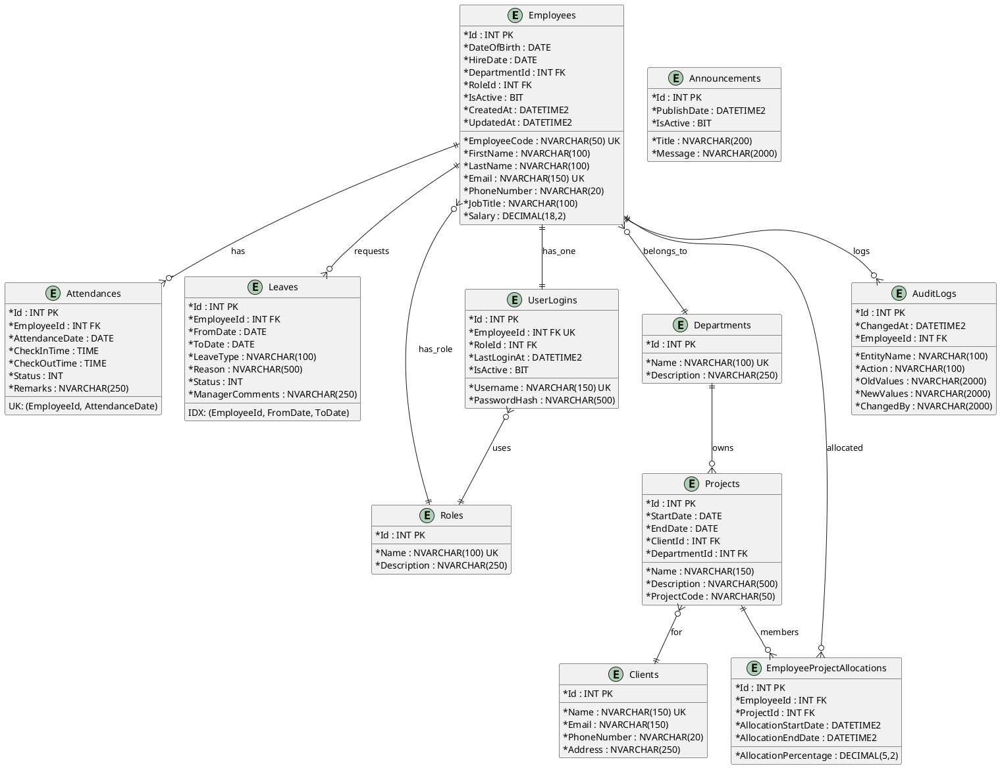

## 3. Data Transfer Objects

| Layer | DTO | Key Properties |
|---|---|---|
| **Attendance** | `CheckInDto` | `employeeId`, `attendanceDate?`, `checkInTime?` |
| | `CheckOutDto` | `checkOutTime?`, `remarks?` |
| | `AttendanceDto` | `id`, `employeeId/employeeName`, `attendanceDate`, `checkIn/checkOut`, `status` |
| | `TodayActiveDto` | `totalActive`, `employees[]` |
| **Leave** | `ApplyLeaveDto` | `employeeId`, `fromDate`, `toDate`, `leaveType`, `reason` |
| | `ApproveRejectLeaveDto` | `isApproved`, `managerComments?` |
| | `LeaveDto` | `id`, `employeeId/employeeName`, `fromDate`, `toDate`, `leaveType`, `reason`, `status` |
| **Auth** | `LoginRequestDto` | `username`, `password` |
| | `LoginResponseDto` | `userLoginId`, `username`, `employeeName`, `role`, `token`, `expiresAtUtc` |
| | `ChangePasswordDto` | `userId?`, `employeeId?`, `currentPassword?`, `newPassword` |
| **Employee** | `EmployeeListDto` | `id`, `employeeCode`, `fullName`, `email`, `departmentName`, `roleName` |
| | `EmployeeDetailsDto` | extends `EmployeeListDto` + `firstName`, `lastName`, `jobTitle`, `salary`, etc. |
| | `CreateEmployeeDto` | `username?`, `password?` + full employee fields |
| **Dashboard** | `DashboardDto` | `totalEmployees`, `totalDepartments`, `totalProjects`, `pendingLeaves`, `todayPresentCount` |

## 4. Service Layer

### AttendanceService

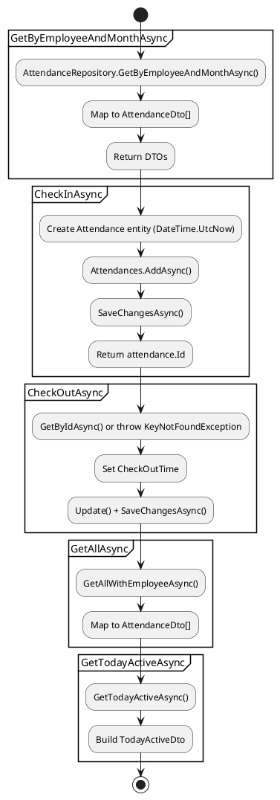

### LeaveService

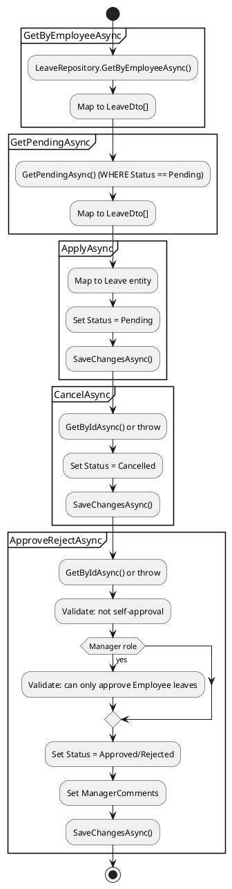

### Auth Flow

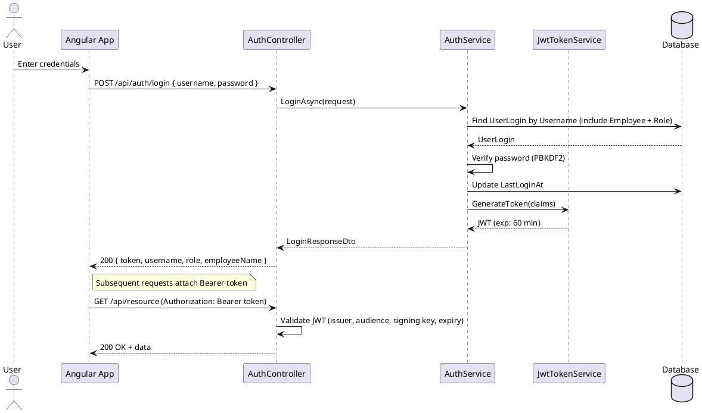

## 5. Repository Layer

### Repository Interface

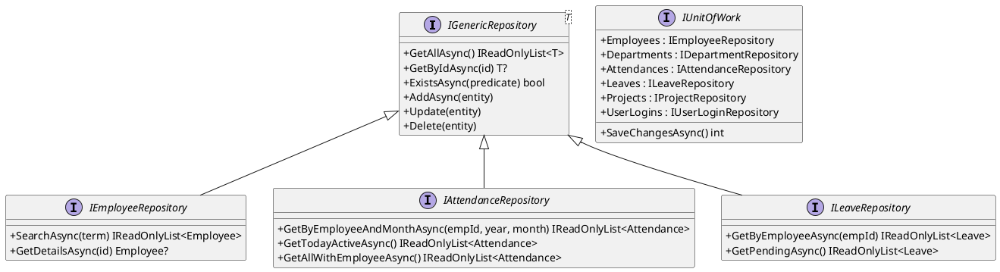

### Key Repository Queries

| Repository | Method | Query Pattern |
|---|---|---|
| **Employee** | `GetAllAsync()` (override) | `Employees.Include(Dept).Include(Role).OrderBy(FirstName)` |
| | `SearchAsync(term)` | `Employees.Include(Dept/Role).Where(Name/Code/Email contains term)` |
| | `GetDetailsAsync(id)` | `Employees.Include(Dept/Role/Attendances/Leaves).FirstOrDefault(id)` |
| **Attendance** | `GetByEmployeeAndMonthAsync()` | `Attendances.Where(EmpId + Year + Month).Include(Employee).OrderByDesc(Date)` |
| | `GetTodayActiveAsync()` | `Attendances.Where(Date==today && CheckOut==null).Include(Employee.Department)` |
| | `GetAllWithEmployeeAsync()` | `Attendances.Include(Employee.Department).OrderByDesc(Date)` |
| **Leave** | `GetByEmployeeAsync()` | `Leaves.Where(EmpId).Include(Employee).OrderByDesc(CreatedAt)` |
| | `GetPendingAsync()` | `Leaves.Where(Status==Pending).Include(Employee).OrderByDesc(CreatedAt)` |

## 6. JWT Token Service

```plantuml
@startuml
partition "Token Generation" {
  () "JWT Claims\n- sub: userLogin.Id\n- employeeId: employee.Id\n- role: role.Name\n- given_name: employee.FullName" as CLAIMS
  () "Symmetric Key\nHmacSha256" as KEY
  () "JWT Token\nissuer: WMS.API\naudience: WMS.Angular\nexpiry: 60 min" as TOKEN
  CLAIMS --> TOKEN
  KEY --> TOKEN
}
partition "Client Storage" {
  () "localStorage" as STORE
  TOKEN --> STORE : Sent to client
  STORE --> () "Authorization: Bearer token" as HEADER
}
partition "Token Validation" {
  () "ValidateIssuer = true" as V1
  () "ValidateAudience = true" as V2
  () "ValidateLifetime = true (ClockSkew=0)" as V3
  () "ValidateIssuerSigningKey = true" as V4
  HEADER --> V1
  V1 --> V2
  V2 --> V3
  V3 --> V4
}
@enduml
```

## 7. Exception Handling Middleware

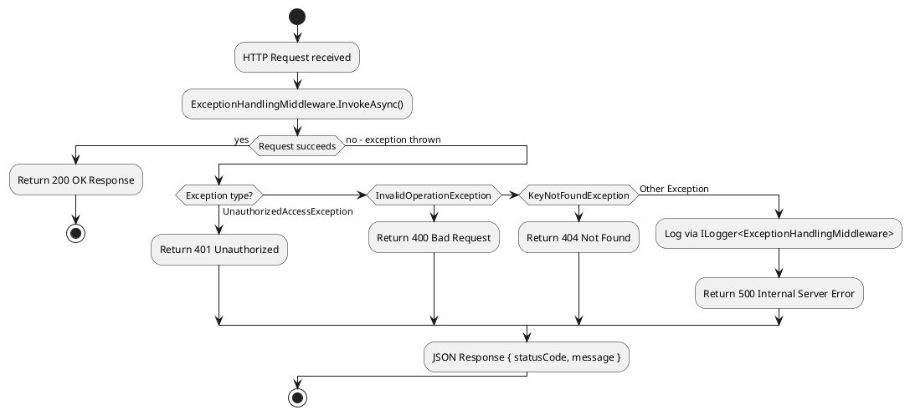

## 8. Frontend Architecture

### Check-In Client Flow

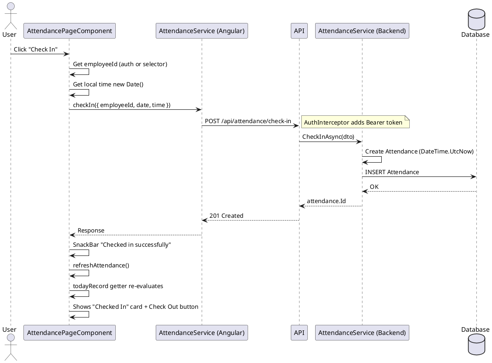

### Auth Interceptor & Guard

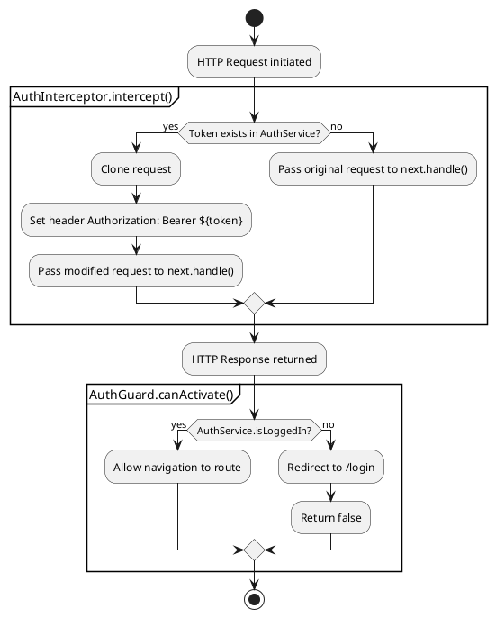

## 9. Key Service Methods

| Service | Method | Description |
|---|---|---|
| **AuthService** | `LoginAsync` | Validate credentials → generate JWT → return user + token |
| | `ChangePasswordAsync` | Verify current password → hash new → update |
| **AttendanceService** | `CheckInAsync` | Create attendance record with UTC timestamp |
| | `CheckOutAsync` | Update existing attendance with check-out time |
| | `GetTodayActiveAsync` | Return all employees checked in but not out today |
| **LeaveService** | `ApplyAsync` | Create leave request with Pending status |
| | `ApproveRejectAsync` | Validate permissions → update status |
| | `CancelAsync` | Set status to Cancelled |
| **DashboardService** | `GetDashboardAsync` | Aggregate KPIs across all entities |
| **EmployeeService** | `GetAllAsync` | Return all employees with Department/Role names |
| | `CreateAsync` | Create employee + optional UserLogin |

## 10. Seed Data

| Table | Records |
|---|---|
| **Roles** | Admin (1), Manager (2), Employee (3) |
| **Departments** | HR (1), IT (2), Finance (3) |
| **Clients** | Internal (1) |
| **Employees** | System Admin (1) — IT dept, Admin role |
| **UserLogins** | admin / Admin@123 (1) |
| **Announcements** | Welcome message |

## 11. Pipeline Configuration

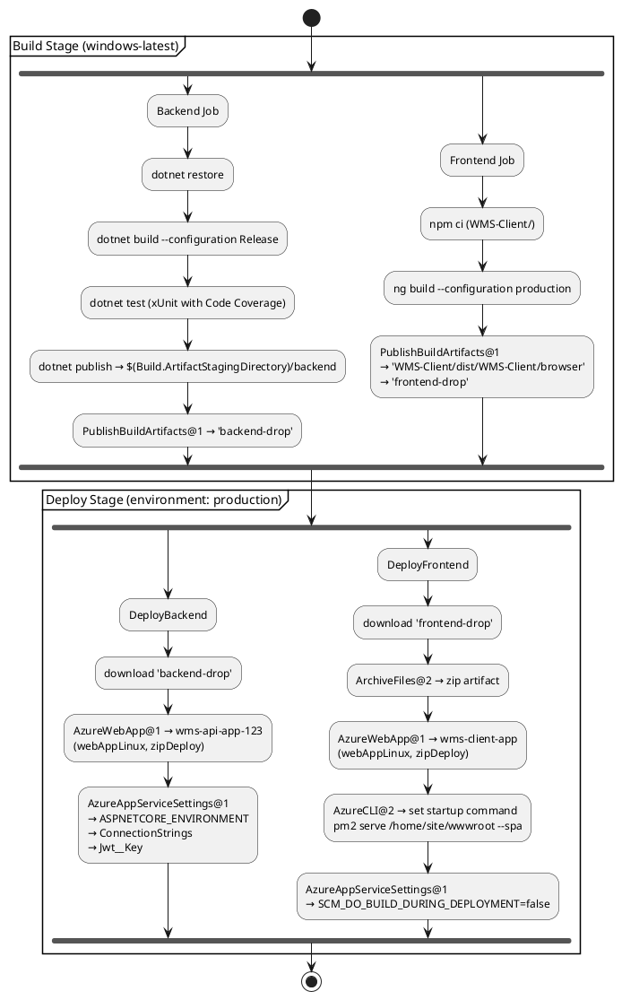

## 12. Configuration

| Environment | Key | Value |
|---|---|---|
| **Dev** | `ConnectionStrings.DefaultConnection` | `Server=localhost\SQLEXPRESS;Database=WMSDb;Trusted_Connection=True` |
| | `Jwt:Key` | `0123456789ABCDEFGHIJKLMNOPQRSTUVWXYZabcdefghijklmnopqrstuvwxyz!@#` |
| | `Jwt:ExpiryMinutes` | `60` |
| **Prod** | `SqlServerFqdn` | Azure SQL server FQDN |
| | `ASPNETCORE_ENVIRONMENT` | `Production` |
| | `SCM_DO_BUILD_DURING_DEPLOYMENT` | `false` (frontend) |
| **Frontend** | `apiUrl` | `https://wms-api-app-123-xxx.centralindia-01.azurewebsites.net/api` |
